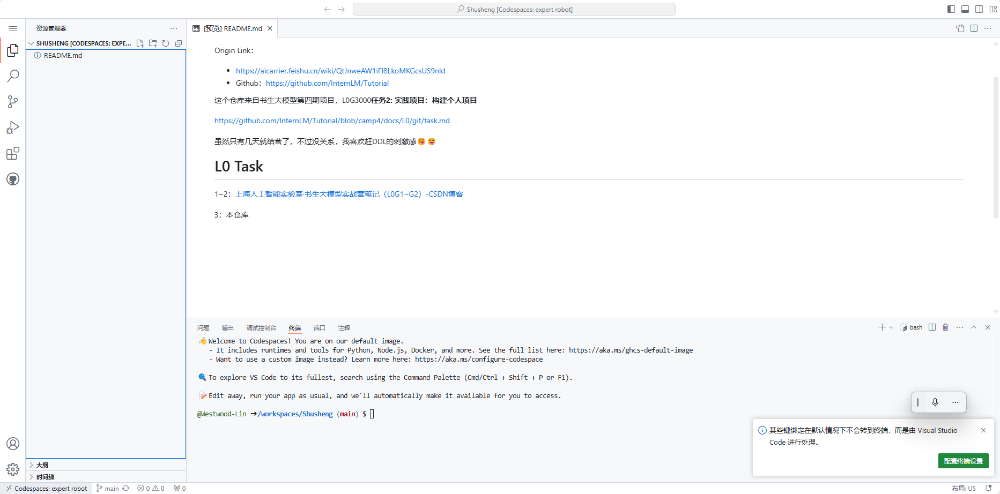
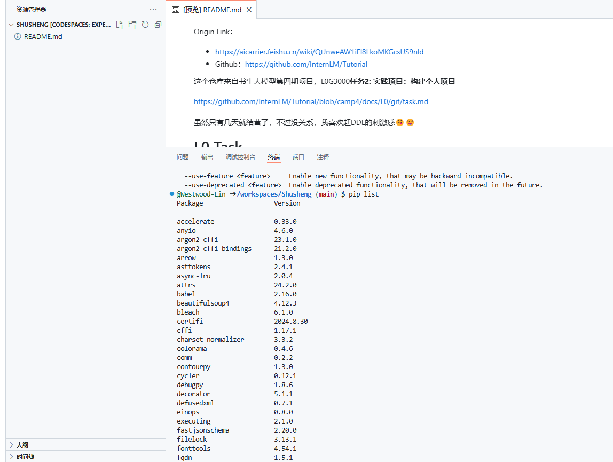
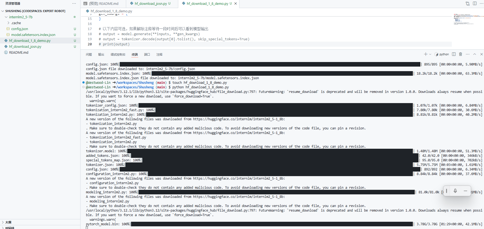
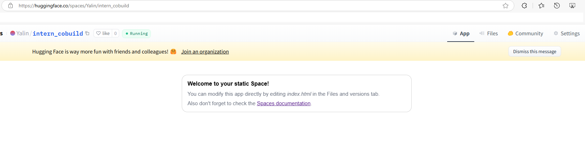
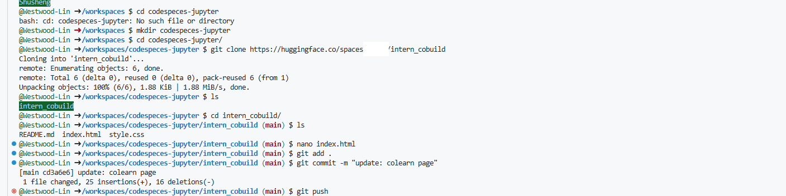
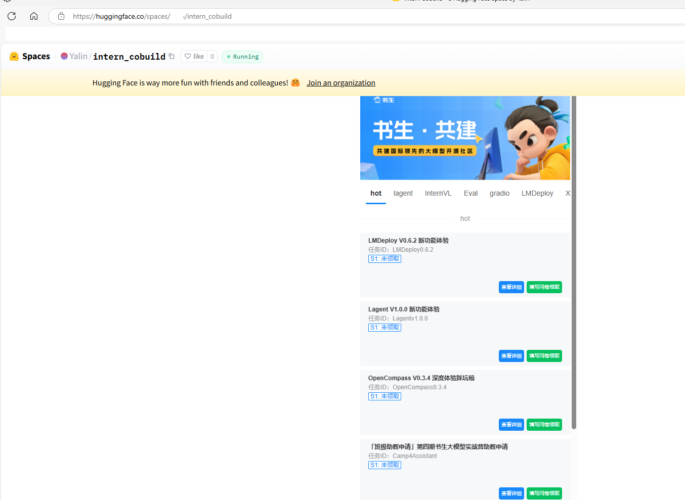
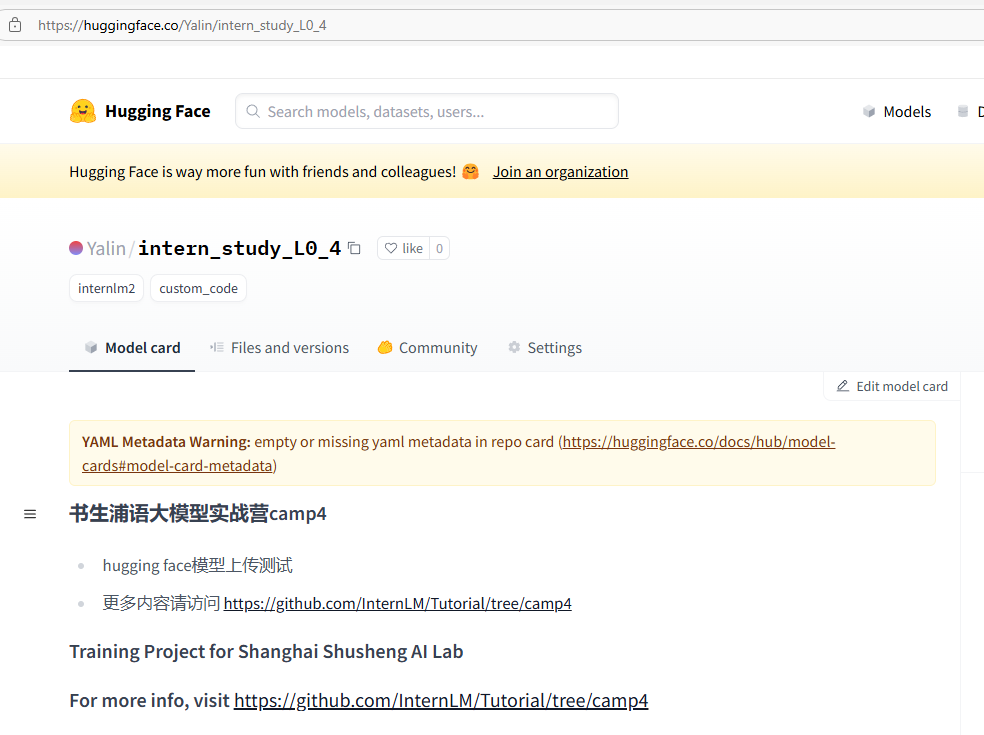
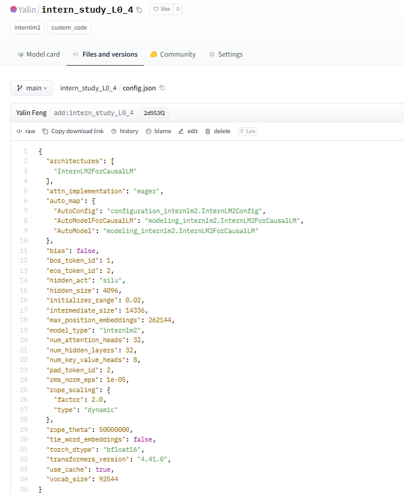

# 玩转HF/魔搭/魔乐社区

书生大模型项目是我见过文档最齐全、考虑国内环境最周全、上手最简单、最低门槛的ai新手训练项目。

# 1. L0G4000-Task

闯关任务需要在关键步骤当中截图！

| 任务                                                         | 描述                                                         | 时间  |
| ------------------------------------------------------------ | ------------------------------------------------------------ | ----- |
| [模型下载](https://huggingface.co/internlm/internlm2-chat-1_8b) | 使用Hugging Face平台、魔搭社区平台（可选）和魔乐社区平台（可选）下载文档中提到的模型（至少需要下载config.json文件、model.safetensors.index.json文件），请在必要的步骤以及结果当中截图。 | 20min |
| 模型上传（可选）                                             | 将我们下载好的config.json文件（也自行添加其他模型相关文件）上传到对应HF平台和魔搭社区平台，并截图。 | 10min |
| Space上传（可选）                                            | 在HF平台上使用Spaces并把intern_cobuild部署成功，关键步骤截图。 | 10min |

- 我的工作：完成了三个任务中与Huggingface相关的部分。


# 2. HF

>  Hugging Face 最初专注于开发聊天机器人服务。尽管他们的聊天机器人项目并未取得预期的成功，但他们在GitHub上开源的Transformers库却意外地在机器学习领域引起了巨大轰动。如今，Hugging Face已经发展成为一个拥有超过100,000个预训练模型和10,000个数据集的平台，被誉为机器学习界的GitHub。
>
> Github CodeSpace是Github推出的线上代码平台，提供了一系列templates，我们这里选择**Jupyter Notebook**进行创建环境。创建好环境后，可以进入网页版VSCode的界面，这就是CodeSpace提供给我们的在线编程环境。https://github.com/codespaces

有趣的Background。


## 2.1 Start Codespace and download config




- 安装依赖：

```bash
# 安装transformers
pip install transformers==4.38
pip install sentencepiece==0.1.99
pip install einops==0.8.0
pip install protobuf==5.27.2
pip install accelerate==0.33.0
```





- 下载配置文件和相关模型参数文件

```
touch hf_download_josn.py
... copy paste ...
python hf_download_josn.py
touch hf_download_1_8_demo.py
... copy paste ...
python hf_download_1_8_demo.py
```





## 2.2 Start HF Web app

创建一个static web app




## 2.3	Push to HF

按照教程，在Github 云端Codespace上创建文件夹，clone HF web app上的内容后，修改 index.html 页面，然后git push回去




检验效果：OK了




## 2.4  上传模型到HF

[Yalin/intern_study_L0_4 · Hugging Face](https://huggingface.co/Yalin/intern_study_L0_4)






# 3. 最后

魔搭社区平台

> ModelScope 是一个“模型即服务”(MaaS)平台，由阿里巴巴集团的达摩院推出和维护。它旨在汇集来自AI社区的最先进的机器学习模型，并简化在实际应用中使用AI模型的流程。通过ModelScope，用户可以轻松地探索、推理、微调和部署各种AI模型。
>
> 注册登录ModelScope平台，进入导航栏模型库，可以搜索internlm找到相关模型（但是这也包括非官方模型），在这里我们可以搜索 internlm2_5-chat-1_8b，下载1.8b的对话模型，也类似于hugging face 一样拥有具体的详情页。

Modelers

> 魔乐社区（Modelers）是一个提供多样化、开源模型的平台，旨在促进开发者和研究人员在最先进的模型和流行应用上进行协作。

Task Reference

> https://github.com/InternLM/Tutorial/tree/camp4/docs/L0/maas

- 一点感想：

这个书生大模型项目是我见过文档最齐全、考虑国内环境最周全、上手最简单、最低门槛的ai新手训练项目。

照着文档做，也就十来分钟，我们就完成了从拉取代码、配置LLM依赖、创建Huggingface 在线应用、代码更新、模型下载配置等一系列流程，而且使用 Github Codespace也是考虑到了下载Huggingface的网络问题，真的很贴心了~ 🌹

Huggingface这个网站我在2022年写本科毕设的时候才发现，当时惊为天人。22年11月底ChatGpt出来以后，ModelScope和Modelers也出现了。国产虽然和Huggingface还有差距，不过进度真是神速。这挺好。

